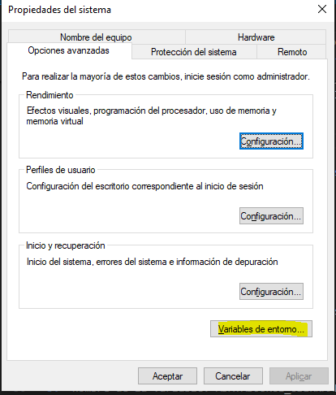
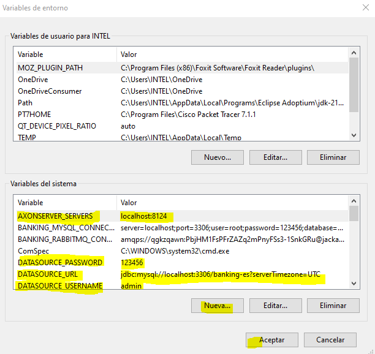
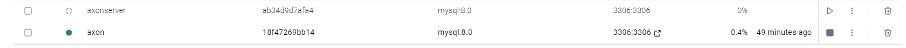
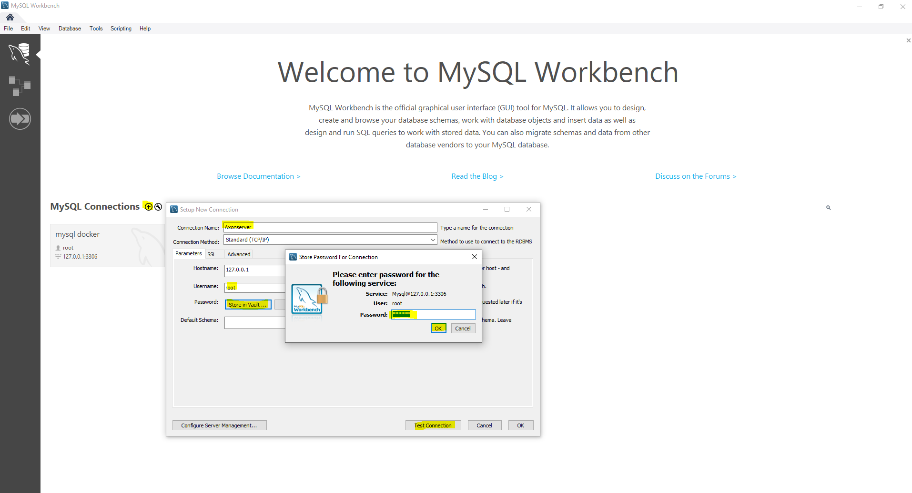
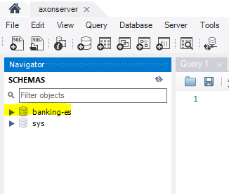
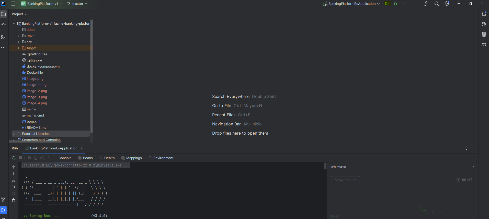
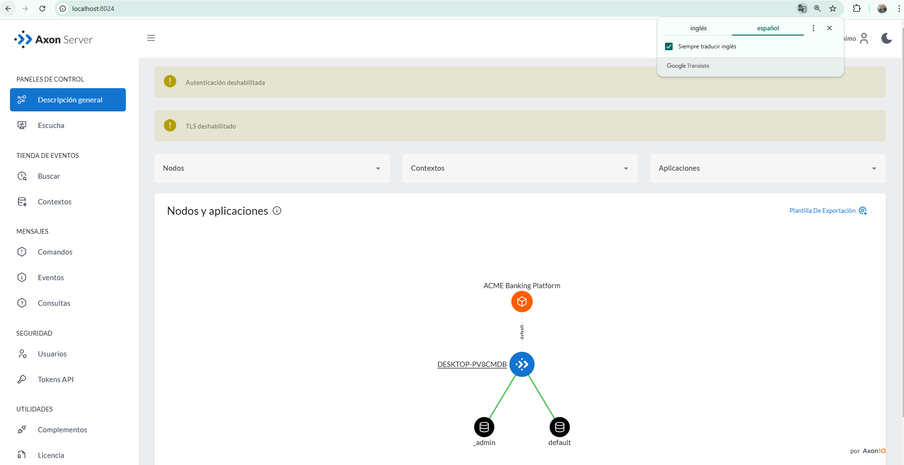

# Banking Platform

## Axon Server
- https://download.axoniq.io/axonserver/AxonServer.zip

### Run Axon Server
```
$ cd /
$ cd c/efra/tools/AxonServer-2024.1.4
$ java -jar axonserver.jar
```

### Axon Server URL
- http://localhost:8024/

### API URL
- http://localhost:8080/swagger-ui/index.html


# MI despliegue desde cero en Banking Platform-v1


## descragar AxonServer y descomprimirlo
- https://download.axoniq.io/axonserver/AxonServer.zip

## ingresar a la capeta descomprimida y correr axon  en el terminal de intellij index

# C:\Users\INTEL> d:
# D:\>cd tools
# D:\tools>cd AxonServer-2024.1.4
# D:\tools\AxonServer-2024.1.4> java -jar axonserver.jar
     _                     ____
    / \   __  _____  _ __ / ___|  ___ _ ____   _____ _ __
   / _ \  \ \/ / _ \| '_ \\___ \ / _ \ '__\ \ / / _ \ '__|
  / ___ \  >  < (_) | | | |___) |  __/ |   \ V /  __/ |
 /_/   \_\/_/\_\___/|_| |_|____/ \___|_|    \_/ \___|_|
 2024.1.4                      Powered by AxonIQ

# Me dirijo a entornos de variables



# presionamos en variables de entorno y creamos  4 bariables  en variables  del sistema  y presionamos nuevo



1.  nombre de la variable: AXONSERVER_SERVERS 
    valor de la variable: localhost:8124

    # luego le das en aceptar 
    # despues le das en nueva

2.  nombre de la variable: ADATASOURCE_URL 
    valor de la variable: jdbc:mysql://localhost:3306/banking-es?serverTimezone=UTC

    # luego le das en aceptar 
    # despues le das en nueva

3.  nombre de la variable: ADATASOURCE_USERNAME 
    valor de la variable: admin

    # luego le das en aceptar 
    # despues le das en nueva

4. nombre de la variable: DATASOURCE_PASSWORD 
    valor de la variable: 123456

    # luego le das en aceptar al crear la ultima variable del sistema
    # despues le das en aceptar

# ahora crearemos el servicio en docker por comandos en CMD o Powershell

1. win + R    e introduces CMD

2. Crear nuevo contenedor en docker mediante CMD (tener instalado docker desktop) 

C:\Users\INTEL>docker run --name mysql8-container -e MYSQL_ROOT_PASSWORD=123456 -e MYSQL_DATABASE=banking-es -e MYSQL_USER=admin -e MYSQL_PASSWORD=123456 -p 3306:3306 -d mysql:8.0 



# Ojo aqui tienes que cambiar  "MYSQL_USER=admin" y esto MYSQL_PASSWORD=123456 para que se cree una nueva conneccion en msql en docker

# luego crearemos la coneccion con la base de datos 

  1. presionamos en + de MySQL Workbench y tendremos una cuadro
  2. colocar   el nombre de la coneccion que prefieras
  3.  modificar el password presionando en "store in vault..." que igual desplegara un cuadro nuevo inglesas el password 123456 y le das a okey  



# luego le das a test connection en caso seguistes lo pasos te saldra  saccesfull tes coneccion  y te llevara a la siguiente vista donde solo por el momento tendras la base de datos sin tablas 



# ahora  iremos al IDE Intellij a correr el proyecto 

1. ojo tener en cuenta el JDK en version 11
2. ojo tener en cuenta el SDK en version 22
3. ojo estos dos se pueden solucionar desde el IDE de Intellij IDE en configuracion

# levantar la aplicacion

  .   ____          _            __ _ _
 /\\ / ___'_ __ _ _(_)_ __  __ _ \ \ \ \
( ( )\___ | '_ | '_| | '_ \/ _` | \ \ \ \
 \\/  ___)| |_)| | | | | || (_| |  ) ) ) )
  '  |____| .__|_| |_|_| |_\__, | / / / /
 =========|_|==============|___/=/_/_/_/

 :: Spring Boot ::                (v3.4.0)



# ingresas a los siguientes link para el axon y el swagger

### Axon Server URL
- http://localhost:8024/

### API URL
- http://localhost:8080/swagger-ui/index.html


# al final tendras levantado todo el servicio


